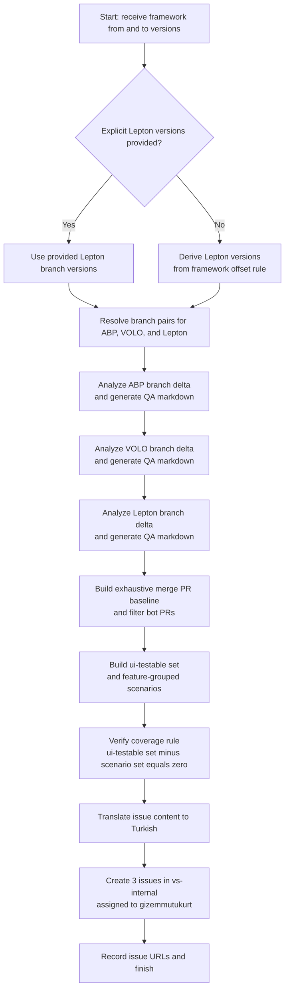
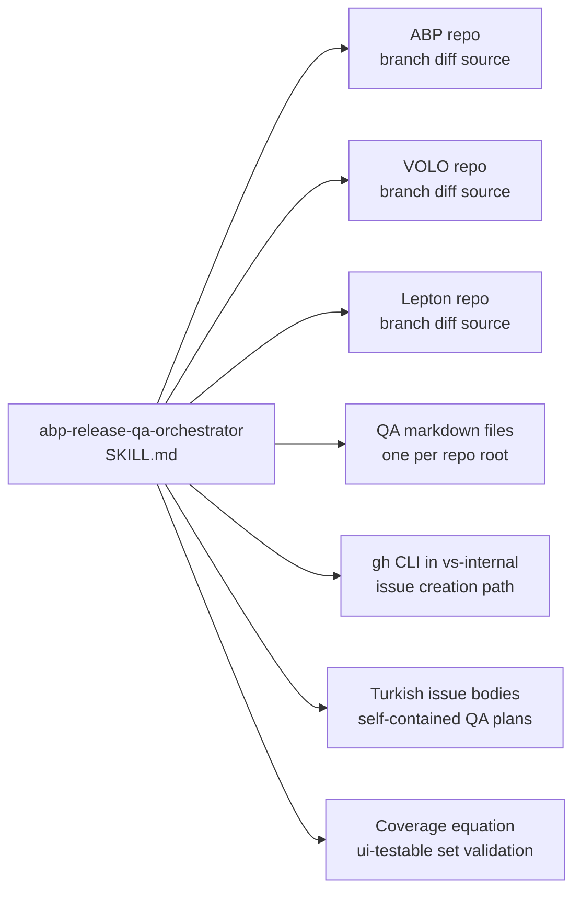

# abp-release-qa-orchestrator Dependency Map

This document shows which repositories, generated artifacts, GitHub actions, and validation rules are involved in the `abp-release-qa-orchestrator` flow in this repository.

Primary skill file:

- [`opencode/skills/abp-release-qa-orchestrator/SKILL.md`](../opencode/skills/abp-release-qa-orchestrator/SKILL.md)

Docs index:

- [Workflow Documentation Index](./README.md)

## Related Workflow Docs

- [abp-source-reference Dependency Map](./abp-source-reference-dependency-map.md) - documents the same ABP, VOLO, and Lepton source roots this workflow analyzes

## Mermaid Flowchart



## Mermaid Dependency Graph



## ASCII Fallback

```text
abp-release-qa-orchestrator
  |
  +-- uses source repos
  |     - C:\P\abp
  |     - C:\P\volo
  |     - C:\P\lepton
  |
  +-- derives branch ranges
  |     - framework rel-from -> rel-to
  |     - lepton explicit or offset-derived
  |
  +-- generates per-repo QA markdown
  |     - one changelog and testing scenario file per repo
  |
  +-- filters and maps PRs
  |     - remove bot PRs
  |     - build ui-testable set
  |     - verify coverage equation
  |
  +-- creates output issues
        - 3 Turkish issues in vs-internal
        - assigned to gizemmutukurt
```

## Dependency Table

| Type | Name | Repository Path | Relationship to `abp-release-qa-orchestrator` |
|---|---|---|---|
| Skill | `abp-release-qa-orchestrator` | `opencode/skills/abp-release-qa-orchestrator/SKILL.md` | Root skill |
| Source repo | ABP | `C:\P\abp` | Direct branch-diff input source |
| Source repo | VOLO | `C:\P\volo` | Direct branch-diff input source |
| Source repo | Lepton | `C:\P\lepton` | Direct branch-diff input source |
| Output artifact | QA markdown files | repo root of each source repo | Direct generated changelog and test-plan artifacts |
| Runtime capability | `gh` CLI in `vs-internal` | `C:\P\vs-internal` | Direct issue-creation path |
| Output artifact | Turkish GitHub issues | not in repo | Final QA planning output |
| Validation rule | UI coverage equation | not in repo | Direct completion rule before issue creation |
| Related workflow doc | [abp-source-reference](./abp-source-reference-dependency-map.md) | `docs/abp-source-reference-dependency-map.md` | Documents the same local source roots used by this workflow |

## What Is Direct vs Indirect

Direct runtime references from `abp-release-qa-orchestrator`:

1. `C:\P\abp`
2. `C:\P\volo`
3. `C:\P\lepton`
4. `C:\P\vs-internal`
5. Generated QA markdown files
6. Turkish issue output through `gh`

Direct validation rule:

1. `ui_testable_set - scenario_pr_set = 0`

Related workflow docs:

1. [abp-source-reference](./abp-source-reference-dependency-map.md)

## Guidance For Repo Organization

This kind of diagram belongs in `docs/`, not under `opencode/`.

Reason:

1. `opencode/` should stay limited to runtime assets.
2. `docs/` can hold diagrams, explanation, dependency maps, and contributor notes.
3. That keeps the runtime clean while still making the repository understandable to humans.
