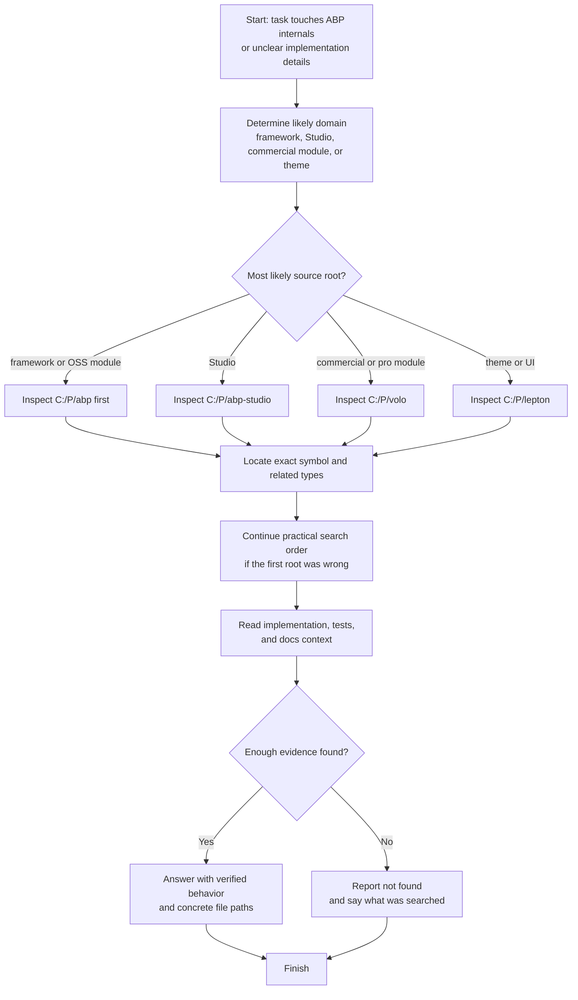
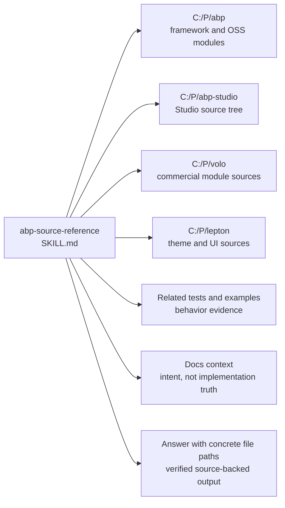

# abp-source-reference Dependency Map

This document shows which local source roots, lookup steps, and evidence paths are involved in the `abp-source-reference` workflow in this repository.

Primary skill file:

- `opencode/skills/abp-source-reference/SKILL.md`

Docs index:

- [Workflow Documentation Index](./README.md)

## Related Workflow Docs

- [handle-abp-github-issue Dependency Map](./handle-abp-github-issue-dependency-map.md) - ABP issue workflow that loads this skill for source-backed verification
- [handle-abp-support-ticket Dependency Map](./handle-abp-support-ticket-dependency-map.md) - support workflow that loads this skill for source-backed verification
- [abpdev-references Dependency Map](./abpdev-references-dependency-map.md) - local reference workflow that often points into the same source roots
- [abp-release-qa-orchestrator Dependency Map](./abp-release-qa-orchestrator-dependency-map.md) - QA workflow that analyzes the same ABP, VOLO, and Lepton repositories

## Mermaid Flowchart



## Mermaid Dependency Graph



## ASCII Fallback

```text
abp-source-reference
  |
  +-- uses four local source roots
  |     - C:\P\abp
  |     - C:\P\abp-studio
  |     - C:\P\volo
  |     - C:\P\lepton
  |
  +-- follows practical search order
  |     - abp
  |     - abp-studio when Studio-specific
  |     - volo for commercial modules
  |     - lepton for theme and UI work
  |
  +-- verifies with real evidence
  |     - exact symbol path
  |     - related interfaces and base classes
  |     - tests and docs context
  |
  +-- outputs
        - source-backed answer with file paths
        - or explicit not-found report with search scope
```

## Dependency Table

| Type | Name | Repository Path | Relationship to `abp-source-reference` |
|---|---|---|---|
| Skill | `abp-source-reference` | `opencode/skills/abp-source-reference/SKILL.md` | Root skill |
| Source root | ABP | `C:\P\abp` | Direct framework and OSS module lookup root |
| Source root | ABP Studio | `C:\P\abp-studio` | Direct Studio lookup root |
| Source root | VOLO | `C:\P\volo` | Direct commercial module lookup root |
| Source root | Lepton | `C:\P\lepton` | Direct theme and UI lookup root |
| Evidence source | Tests and examples | under the source roots | Direct behavior verification aid |
| Evidence source | Docs context | under the source roots and external docs | Supporting context, not implementation truth |
| Output artifact | Source-backed answer | not in repo | Final answer with concrete file paths and verified behavior |
| Related workflow doc | [handle-abp-github-issue](./handle-abp-github-issue-dependency-map.md) | `docs/handle-abp-github-issue-dependency-map.md` | Direct consumer workflow |
| Related workflow doc | [handle-abp-support-ticket](./handle-abp-support-ticket-dependency-map.md) | `docs/handle-abp-support-ticket-dependency-map.md` | Direct consumer workflow |
| Related workflow doc | [abpdev-references](./abpdev-references-dependency-map.md) | `docs/abpdev-references-dependency-map.md` | Adjacent local-source workflow |
| Related workflow doc | [abp-release-qa-orchestrator](./abp-release-qa-orchestrator-dependency-map.md) | `docs/abp-release-qa-orchestrator-dependency-map.md` | Adjacent ABP source-root analysis workflow |

## What Is Direct vs Indirect

Direct runtime references from `abp-source-reference`:

1. `C:\P\abp`
2. `C:\P\abp-studio`
3. `C:\P\volo`
4. `C:\P\lepton`
5. Tests and example code inside those roots

Supporting evidence source:

1. Docs context after the real implementation is located

Related workflow docs:

1. [handle-abp-github-issue](./handle-abp-github-issue-dependency-map.md)
2. [handle-abp-support-ticket](./handle-abp-support-ticket-dependency-map.md)
3. [abpdev-references](./abpdev-references-dependency-map.md)
4. [abp-release-qa-orchestrator](./abp-release-qa-orchestrator-dependency-map.md)

## Guidance For Repo Organization

This kind of diagram belongs in `docs/`, not under `opencode/`.

Reason:

1. `opencode/` should stay limited to runtime assets.
2. `docs/` can hold diagrams, explanation, dependency maps, and contributor notes.
3. That keeps the runtime clean while still making the repository understandable to humans.
