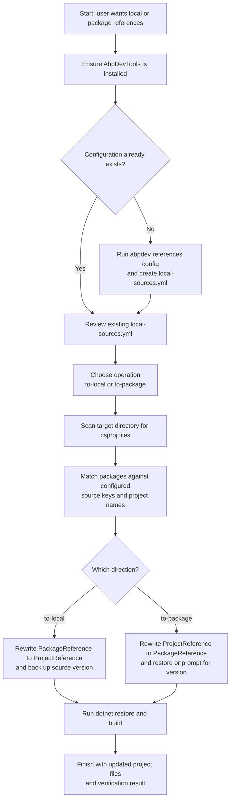
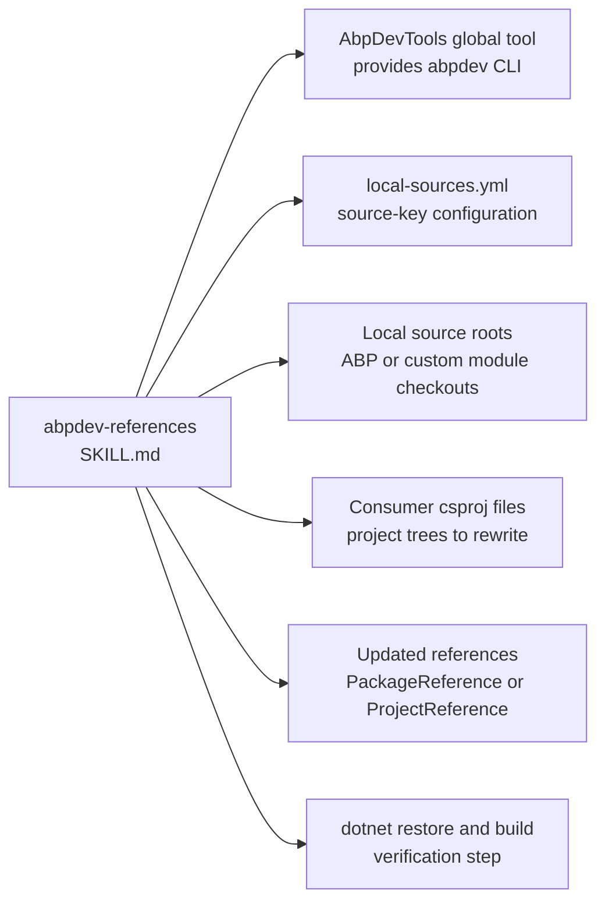

# abpdev-references Dependency Map

This document shows which configuration files, local source trees, project files, and verification steps are involved in the `abpdev-references` flow in this repository.

Primary skill file:

- `opencode/skills/abpdev-references/SKILL.md`

Docs index:

- [Workflow Documentation Index](./README.md)

## Related Workflow Docs

- [abp-source-reference Dependency Map](./abp-source-reference-dependency-map.md) - source-tree lookup workflow for the local repos that `abpdev` can point to
- [handle-abp-github-issue Dependency Map](./handle-abp-github-issue-dependency-map.md) - issue workflow that explicitly uses `abpdev references to-local` during fresh-project validation

## Mermaid Flowchart



## Mermaid Dependency Graph



## ASCII Fallback

```text
abpdev-references
  |
  +-- uses AbpDevTools global tool
  |     - provides the abpdev CLI
  |
  +-- uses local-sources.yml
  |     - source keys, paths, branches, package patterns
  |
  +-- scans local source roots
  |     - ABP Framework or other module checkouts
  |
  +-- scans target consumer csproj files
  |     - converts between package refs and project refs
  |
  +-- verifies with
        - dotnet restore
        - dotnet build
```

## Dependency Table

| Type | Name | Repository Path | Relationship to `abpdev-references` |
|---|---|---|---|
| Skill | `abpdev-references` | `opencode/skills/abpdev-references/SKILL.md` | Root skill |
| Runtime capability | AbpDevTools global tool | not in repo | Provides the `abpdev references` CLI |
| Configuration file | `local-sources.yml` | `%AppData%\abpdev\local-sources.yml` | Direct configuration source for local roots and package patterns |
| Runtime asset | Local source roots | varies | Direct source trees used to resolve project references |
| Runtime asset | Consumer `.csproj` files | varies | Direct files rewritten by `to-local` or `to-package` |
| Output artifact | Updated reference entries | varies | Final state of rewritten `.csproj` references and version backup properties |
| Verification step | `dotnet restore` and `dotnet build` | not in repo | Recommended verification after switching references |
| Related workflow doc | [abp-source-reference](./abp-source-reference-dependency-map.md) | `docs/abp-source-reference-dependency-map.md` | Documents the common ABP local source roots often used here |
| Related workflow doc | [handle-abp-github-issue](./handle-abp-github-issue-dependency-map.md) | `docs/handle-abp-github-issue-dependency-map.md` | Consumer workflow that uses `abpdev references to-local` for validation |

## What Is Direct vs Indirect

Direct runtime references from `abpdev-references`:

1. AbpDevTools and the `abpdev` CLI
2. `%AppData%\abpdev\local-sources.yml`
3. Local source roots
4. Consumer `.csproj` files
5. `dotnet restore` and `dotnet build` verification

Related workflow docs:

1. [abp-source-reference](./abp-source-reference-dependency-map.md)
2. [handle-abp-github-issue](./handle-abp-github-issue-dependency-map.md)

## Guidance For Repo Organization

This kind of diagram belongs in `docs/`, not under `opencode/`.

Reason:

1. `opencode/` should stay limited to runtime assets.
2. `docs/` can hold diagrams, explanation, dependency maps, and contributor notes.
3. That keeps the runtime clean while still making the repository understandable to humans.
