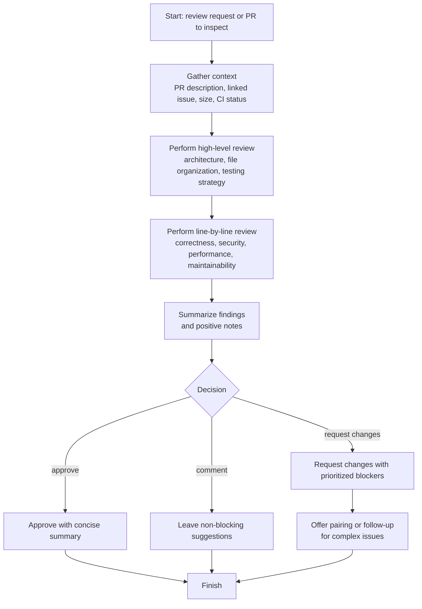
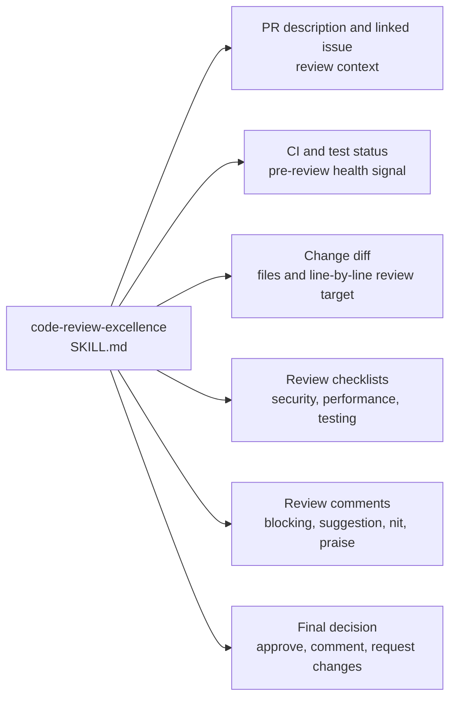

# code-review-excellence Dependency Map

This document shows which review inputs, checklists, and decision points are involved in the `code-review-excellence` workflow in this repository.

Primary skill file:

- [`opencode/skills/code-review-excellence/SKILL.md`](../opencode/skills/code-review-excellence/SKILL.md)

Docs index:

- [Workflow Documentation Index](./README.md)

## Related Workflow Docs

- [handle-github-issue Dependency Map](./handle-github-issue-dependency-map.md) - issue workflow that often produces PRs to review
- [handle-abp-github-issue Dependency Map](./handle-abp-github-issue-dependency-map.md) - ABP issue workflow that often produces PRs to review

## Mermaid Flowchart



## Mermaid Dependency Graph



## ASCII Fallback

```text
code-review-excellence
  |
  +-- gathers review context
  |     - PR description
  |     - linked issue
  |     - CI status
  |
  +-- performs two review passes
  |     - high-level architecture and testing pass
  |     - line-by-line correctness and quality pass
  |
  +-- produces feedback
  |     - blockers
  |     - suggestions
  |     - praise
  |
  +-- ends with a decision
        - approve
        - comment
        - request changes
```

## Dependency Table

| Type | Name | Repository Path | Relationship to `code-review-excellence` |
|---|---|---|---|
| Skill | `code-review-excellence` | `opencode/skills/code-review-excellence/SKILL.md` | Root skill |
| Review input | PR description and linked issue | not in repo | Direct context for understanding the change |
| Review input | CI and test status | not in repo | Direct pre-review health signal |
| Review input | Change diff | varies | Direct inspection target |
| Review aid | Review checklists | in skill content | Direct structured review guidance |
| Output artifact | Review comments | not in repo | Direct feedback output |
| Output artifact | Review decision | not in repo | Final approve/comment/request-changes result |
| Related workflow doc | [handle-github-issue](./handle-github-issue-dependency-map.md) | `docs/handle-github-issue-dependency-map.md` | Upstream workflow that commonly produces PRs |
| Related workflow doc | [handle-abp-github-issue](./handle-abp-github-issue-dependency-map.md) | `docs/handle-abp-github-issue-dependency-map.md` | Upstream ABP issue workflow that commonly produces PRs |

## What Is Direct vs Indirect

Direct runtime references from `code-review-excellence`:

1. PR description and linked issue
2. CI and test status
3. Change diff
4. Review checklists
5. Review comments and final decision

Related workflow docs:

1. [handle-github-issue](./handle-github-issue-dependency-map.md)
2. [handle-abp-github-issue](./handle-abp-github-issue-dependency-map.md)

## Guidance For Repo Organization

This kind of diagram belongs in `docs/`, not under `opencode/`.

Reason:

1. `opencode/` should stay limited to runtime assets.
2. `docs/` can hold diagrams, explanation, dependency maps, and contributor notes.
3. That keeps the runtime clean while still making the repository understandable to humans.
