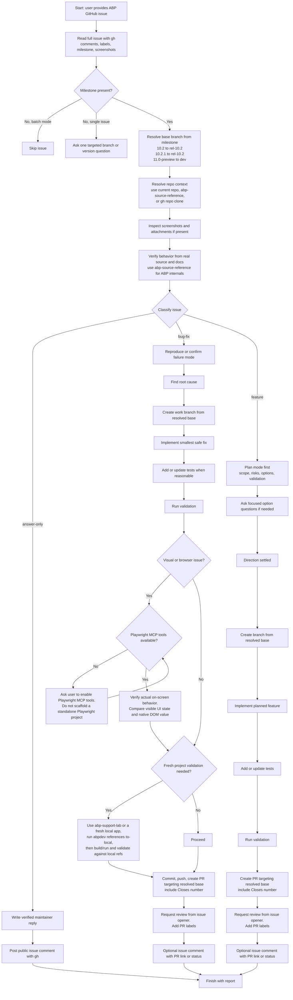

# handle-abp-github-issue Dependency Map

This document shows which skills, subagents, and related runtime assets are involved in the `handle-abp-github-issue` flow in this repository.

Primary skill file:

- [`opencode/skills/handle-abp-github-issue/SKILL.md`](../opencode/skills/handle-abp-github-issue/SKILL.md)

Docs index:

- [Workflow Documentation Index](./README.md)

## Related Workflow Docs

- [handle-github-issue Dependency Map](./handle-github-issue-dependency-map.md) - the generic issue-handling flow that this skill specializes for ABP repos
- [handle-abp-support-ticket Dependency Map](./handle-abp-support-ticket-dependency-map.md) - adjacent ABP support workflow that can feed into issue work
- [abp-source-reference Dependency Map](./abp-source-reference-dependency-map.md) - source-root lookup workflow used for ABP internals verification
- [abpdev-references Dependency Map](./abpdev-references-dependency-map.md) - local reference switching workflow used during fresh-project validation

## Mermaid Diagram



## ASCII Fallback

```text
handle-abp-github-issue
  |
  +-- uses abp-source-reference
  |     - skill file: opencode/skills/abp-source-reference/SKILL.md
  |     - purpose: inspect real ABP source instead of guessing
  |
  +-- uses abp-support-lab (when exact validation is needed)
  |     - agent file: opencode/agent/abp-support-lab.md
  |     - purpose: generate a fresh ABP app and validate guidance or fixes
  |     |
  |     +-- may use worker-browser-test
  |           - agent file: opencode/agent/worker-browser-test.md
  |           - purpose: browser verification for fresh-project validation
  |
  +-- uses Playwright MCP/browser tools (for visual issues)
  |     - runtime capability, not a repo-local file
  |     - purpose: verify actual on-screen state, not only underlying DOM values
  |     - compare visible wrapper/UI text with native select or DOM state when needed
  |     - if unavailable, ask the user to enable Playwright MCP tools
  |     - do not replace this with a scratch standalone Playwright/npm project
  |
  +-- uses `abpdev references to-local` command
  |     - used when fresh generated projects must point to local ABP source
  |     - critical for reproducing and validating browser-visible fixes against local source changes
  |     - related repo skill: opencode/skills/abpdev-references/SKILL.md
  |       documents the CLI, but is not explicitly loaded by name here
  |
  +-- optionally mentions external planning flows
  |     - /gsd-quick
  |     - /gsd-plan-phase
  |     - these are referenced as optional workflow choices, not repo-local files here
  |
  +-- optionally mentions external validation command
        - /abp-support-validate
        - referenced by name, but not stored in this repo
```

## Dependency Table

| Type | Name | Repository Path | Relationship to `handle-abp-github-issue` |
|---|---|---|---|
| Skill | `handle-abp-github-issue` | `opencode/skills/handle-abp-github-issue/SKILL.md` | Root skill |
| Skill | [abp-source-reference](./abp-source-reference-dependency-map.md) | `opencode/skills/abp-source-reference/SKILL.md` | Direct referenced skill for ABP internals and source verification |
| Subagent | `abp-support-lab` | `opencode/agent/abp-support-lab.md` | Direct referenced validation subagent for fresh-project verification |
| Subagent | `worker-browser-test` | `opencode/agent/worker-browser-test.md` | Transitive dependency used by `abp-support-lab` for browser validation |
| Runtime capability | Playwright MCP/browser tools | not in repo | Direct validation path for visual issues; verifies visible on-screen state and should be user-enabled when unavailable |
| Skill | [abpdev-references](./abpdev-references-dependency-map.md) | `opencode/skills/abpdev-references/SKILL.md` | Related documentation for the `abpdev references to-local` CLI used in the flow |
| Related workflow doc | [handle-github-issue](./handle-github-issue-dependency-map.md) | `docs/handle-github-issue-dependency-map.md` | Generic upstream issue-handling workflow |
| Related workflow doc | [handle-abp-support-ticket](./handle-abp-support-ticket-dependency-map.md) | `docs/handle-abp-support-ticket-dependency-map.md` | Adjacent ABP support workflow that may surface bugs or feature requests |
| External workflow | `/gsd-quick` | not in repo | Optional feature-planning workflow mentioned by the skill |
| External workflow | `/gsd-plan-phase` | not in repo | Optional feature-planning workflow mentioned by the skill |
| External command | `/abp-support-validate` | not in repo | Alternative validation route mentioned by the skill |

## What Is Direct vs Indirect

Direct runtime references from `handle-abp-github-issue`:

1. [abp-source-reference](./abp-source-reference-dependency-map.md)
2. `abp-support-lab`
3. `abpdev references to-local` command
4. Playwright MCP/browser tools for visual validation

Indirect runtime reference:

1. `worker-browser-test` through `abp-support-lab`

Related workflow docs:

1. [handle-github-issue](./handle-github-issue-dependency-map.md)
2. [handle-abp-support-ticket](./handle-abp-support-ticket-dependency-map.md)
3. [abp-source-reference](./abp-source-reference-dependency-map.md)
4. [abpdev-references](./abpdev-references-dependency-map.md)

Mentioned but not stored in this repository:

1. `/abp-support-validate`
2. `/gsd-quick`
3. `/gsd-plan-phase`

Explicitly avoided fallback for visual issues:

1. Installing standalone Playwright in a scratch npm project instead of asking the user to enable Playwright MCP tools

## Guidance For Repo Organization

This kind of diagram belongs in `docs/`, not under `opencode/`.

Reason:

1. `opencode/` should stay limited to runtime assets.
2. `docs/` can hold diagrams, explanation, dependency maps, and contributor notes.
3. That keeps the runtime clean while still making the repository understandable to humans.
