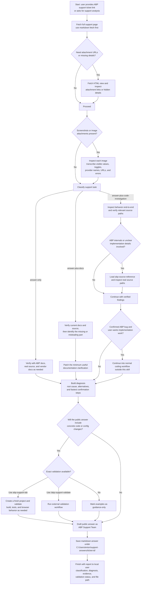
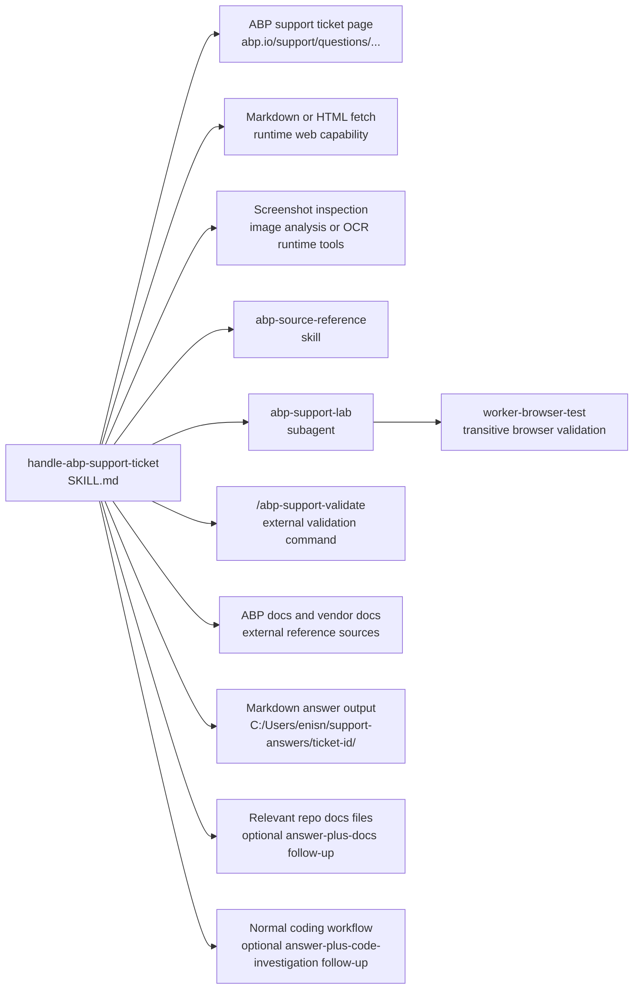

# handle-abp-support-ticket Dependency Map

This document shows which skills, runtime capabilities, external sources, and output artifacts are involved in the `handle-abp-support-ticket` flow in this repository.

Primary skill file:

- [`opencode/skills/handle-abp-support-ticket/SKILL.md`](../opencode/skills/handle-abp-support-ticket/SKILL.md)

Docs index:

- [Workflow Documentation Index](./README.md)

## Related Workflow Docs

- [handle-abp-github-issue Dependency Map](./handle-abp-github-issue-dependency-map.md) - adjacent ABP issue workflow when support analysis turns into public issue work
- [handle-github-issue Dependency Map](./handle-github-issue-dependency-map.md) - generic issue workflow for non-ABP GitHub follow-up
- [abp-source-reference Dependency Map](./abp-source-reference-dependency-map.md) - source-root lookup workflow used for ABP internals verification

## Mermaid Flowchart



## Mermaid Dependency Graph



## ASCII Fallback

```text
handle-abp-support-ticket
  |
  +-- uses support ticket retrieval
  |     - runtime capability: markdown / HTML fetch
  |     - purpose: read the full support ticket, attachment URLs, and missing details
  |
  +-- uses screenshot inspection
  |     - runtime capability: image analysis / OCR tools
  |     - purpose: transcribe visible values, toggles, URLs, provider names, and errors
  |
  +-- uses abp-source-reference
  |     - skill file: opencode/skills/abp-source-reference/SKILL.md
  |     - purpose: inspect real ABP source when internals or conventions matter
  |
  +-- uses abp-support-lab (when exact validation is needed)
  |     - agent file: opencode/agent/abp-support-lab.md
  |     - purpose: validate copy-paste-safe code or config examples on a fresh project
  |     |
  |     +-- may use worker-browser-test
  |           - agent file: opencode/agent/worker-browser-test.md
  |           - purpose: browser verification during fresh-project validation
  |
  +-- may use external validation command
  |     - /abp-support-validate
  |     - purpose: alternative exact-validation path outside this repo
  |
  +-- uses ABP docs and vendor docs
  |     - external web sources, not repo-local files
  |     - purpose: verify framework behavior and third-party provider behavior
  |
  +-- outputs markdown answer files
  |     - default path: C:\Users\enisn\support-answers\<ticket-id>\
  |     - purpose: store public support-team reply drafts
  |
  +-- optional follow-up path: docs changes
  |     - relevant docs files vary by ticket
  |
  +-- optional follow-up path: code investigation / implementation
        - continues in the normal coding workflow outside this skill
```

## Dependency Table

| Type | Name | Repository Path | Relationship to `handle-abp-support-ticket` |
|---|---|---|---|
| Skill | `handle-abp-support-ticket` | `opencode/skills/handle-abp-support-ticket/SKILL.md` | Root skill |
| External source | ABP support ticket page | not in repo | Primary input source, typically `abp.io/support/questions/...` |
| Runtime capability | Markdown/HTML fetch | not in repo | Direct retrieval path for readable ticket content, attachments, and missing details |
| Runtime capability | Image analysis / OCR tools | not in repo | Direct screenshot inspection path for extracting visible values and errors |
| Skill | [abp-source-reference](./abp-source-reference-dependency-map.md) | `opencode/skills/abp-source-reference/SKILL.md` | Direct referenced skill for verifying ABP internals and real source paths |
| Related workflow doc | [handle-abp-github-issue](./handle-abp-github-issue-dependency-map.md) | `docs/handle-abp-github-issue-dependency-map.md` | Adjacent ABP issue workflow for follow-up bug or feature work |
| Related workflow doc | [handle-github-issue](./handle-github-issue-dependency-map.md) | `docs/handle-github-issue-dependency-map.md` | Generic issue follow-up workflow outside ABP-specific repos |
| Subagent | `abp-support-lab` | `opencode/agent/abp-support-lab.md` | Direct referenced validation subagent for exact code/config guidance |
| Subagent | `worker-browser-test` | `opencode/agent/worker-browser-test.md` | Transitive dependency used by `abp-support-lab` for browser validation |
| External command | `/abp-support-validate` | not in repo | Alternative validation route mentioned by the skill |
| External source | ABP docs and vendor docs | not in repo | Direct evidence sources for framework and third-party behavior |
| Output artifact | `support-answers` folder | `C:\Users\enisn\support-answers\<ticket-id>\` | Default storage location for public markdown replies |
| Repo assets | Relevant docs files | varies | Optional `answer-plus-docs` follow-up path |
| Workflow path | Normal coding workflow | varies | Optional `answer-plus-code-investigation` continuation after diagnosis |

## What Is Direct vs Indirect

Direct runtime references from `handle-abp-support-ticket`:

1. Support ticket retrieval through markdown or HTML fetch
2. Screenshot inspection through image analysis or OCR tools
3. [abp-source-reference](./abp-source-reference-dependency-map.md)
4. `abp-support-lab`
5. ABP docs and vendor docs
6. Markdown answer output under `C:\Users\enisn\support-answers\<ticket-id>\`

Indirect runtime reference:

1. `worker-browser-test` through `abp-support-lab`

Related workflow docs:

1. [handle-abp-github-issue](./handle-abp-github-issue-dependency-map.md)
2. [handle-github-issue](./handle-github-issue-dependency-map.md)
3. [abp-source-reference](./abp-source-reference-dependency-map.md)

Mentioned but not stored in this repository:

1. `/abp-support-validate`
2. The live `abp.io/support/questions/...` support pages
3. External ABP docs pages and third-party vendor docs

Optional follow-up paths after the main support analysis:

1. Minimal docs updates for `answer-plus-docs`
2. Normal coding workflow continuation for `answer-plus-code-investigation`

## Guidance For Repo Organization

This kind of diagram belongs in `docs/`, not under `opencode/`.

Reason:

1. `opencode/` should stay limited to runtime assets.
2. `docs/` can hold diagrams, explanation, dependency maps, and contributor notes.
3. That keeps the runtime clean while still making the repository understandable to humans.
