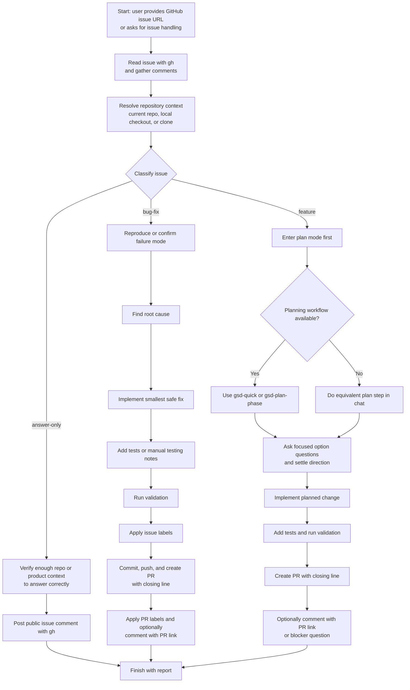
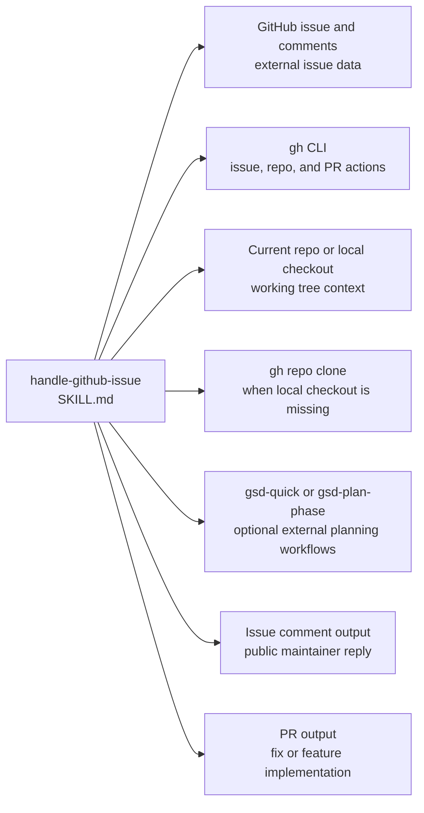

# handle-github-issue Dependency Map

This document shows which tools, external workflows, repository assets, and outputs are involved in the `handle-github-issue` flow in this repository.

Primary skill file:

- [`opencode/skills/handle-github-issue/SKILL.md`](../opencode/skills/handle-github-issue/SKILL.md)

Docs index:

- [Workflow Documentation Index](./README.md)

## Related Workflow Docs

- [handle-abp-github-issue Dependency Map](./handle-abp-github-issue-dependency-map.md) - the ABP-specialized version of this issue workflow
- [code-review-excellence Dependency Map](./code-review-excellence-dependency-map.md) - follow-on review guidance for the PR path

## Mermaid Flowchart



## Mermaid Dependency Graph



## ASCII Fallback

```text
handle-github-issue
  |
  +-- uses GitHub issue data
  |     - issue body, comments, repo metadata
  |     - accessed through gh CLI first
  |
  +-- uses repository context
  |     - current workspace, local checkout, or gh repo clone
  |
  +-- classifies into one of three paths
  |     - answer-only
  |     - bug-fix
  |     - feature
  |
  +-- may use external planning workflows
  |     - /gsd-quick
  |     - /gsd-plan-phase
  |
  +-- outputs either
        - a public issue comment
        - or a PR that closes the issue
```

## Dependency Table

| Type | Name | Repository Path | Relationship to `handle-github-issue` |
|---|---|---|---|
| Skill | `handle-github-issue` | `opencode/skills/handle-github-issue/SKILL.md` | Root skill |
| External source | GitHub issue and comments | not in repo | Primary issue input and public conversation context |
| Runtime capability | `gh` CLI | not in repo | Direct GitHub-native path for issue reads, comments, repo context, and PR creation |
| Runtime asset | Current repo or local checkout | varies | Direct working tree context for reproduction, fixes, and validation |
| Runtime capability | `gh repo clone` | not in repo | Fallback when the correct repo is not already checked out locally |
| External workflow | `/gsd-quick` | not in repo | Optional feature-planning workflow |
| External workflow | `/gsd-plan-phase` | not in repo | Optional larger-scope planning workflow |
| Output artifact | Public issue comment | not in repo | Final output for the `answer-only` path |
| Output artifact | Pull request | not in repo | Final output for `bug-fix` and `feature` paths |
| Related workflow doc | [handle-abp-github-issue](./handle-abp-github-issue-dependency-map.md) | `docs/handle-abp-github-issue-dependency-map.md` | Specialized ABP variant of the same issue-handling flow |
| Related workflow doc | [code-review-excellence](./code-review-excellence-dependency-map.md) | `docs/code-review-excellence-dependency-map.md` | Natural follow-up workflow once a PR is open |

## What Is Direct vs Indirect

Direct runtime references from `handle-github-issue`:

1. GitHub issue data through `gh`
2. Repository working tree context
3. Public issue comments
4. Pull requests

Direct optional workflow references:

1. `/gsd-quick`
2. `/gsd-plan-phase`

Related workflow docs:

1. [handle-abp-github-issue](./handle-abp-github-issue-dependency-map.md)
2. [code-review-excellence](./code-review-excellence-dependency-map.md)

## Guidance For Repo Organization

This kind of diagram belongs in `docs/`, not under `opencode/`.

Reason:

1. `opencode/` should stay limited to runtime assets.
2. `docs/` can hold diagrams, explanation, dependency maps, and contributor notes.
3. That keeps the runtime clean while still making the repository understandable to humans.
