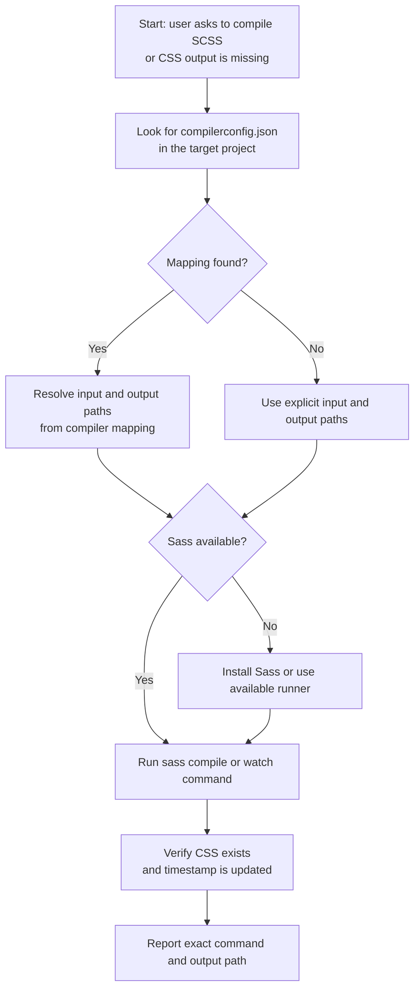
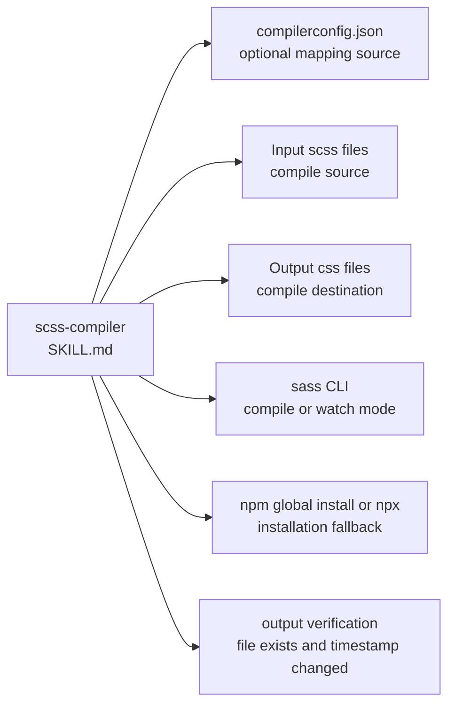

# scss-compiler Dependency Map

This document shows which files, commands, and verification steps are involved in the `scss-compiler` flow in this repository.

Primary skill file:

- `opencode/skills/scss-compiler/SKILL.md`

Docs index:

- [Workflow Documentation Index](./README.md)

## Mermaid Flowchart



## Mermaid Dependency Graph



## ASCII Fallback

```text
scss-compiler
  |
  +-- checks for compilerconfig.json
  |     - uses mapping first when present
  |
  +-- uses explicit file pairs
  |     - input .scss
  |     - output .css
  |
  +-- runs sass
  |     - one-off compile
  |     - or watch mode
  |
  +-- verifies result
        - output file exists
        - output timestamp updated
```

## Dependency Table

| Type | Name | Repository Path | Relationship to `scss-compiler` |
|---|---|---|---|
| Skill | `scss-compiler` | `opencode/skills/scss-compiler/SKILL.md` | Root skill |
| Configuration file | `compilerconfig.json` | varies | Optional direct mapping source for input and output file pairs |
| Runtime asset | Input `.scss` files | varies | Direct compile source |
| Output artifact | Output `.css` files | varies | Direct compile destination |
| Runtime capability | `sass` CLI | not in repo | Direct compile and watch command path |
| Runtime capability | `npm install -g sass` or `npx sass` | not in repo | Install or fallback runner when Sass is unavailable |
| Verification step | Output file existence and timestamp check | not in repo | Direct verification of compile success |

## What Is Direct vs Indirect

Direct runtime references from `scss-compiler`:

1. `compilerconfig.json` when present
2. Input `.scss` files
3. Output `.css` files
4. `sass` CLI
5. Output verification

## Guidance For Repo Organization

This kind of diagram belongs in `docs/`, not under `opencode/`.

Reason:

1. `opencode/` should stay limited to runtime assets.
2. `docs/` can hold diagrams, explanation, dependency maps, and contributor notes.
3. That keeps the runtime clean while still making the repository understandable to humans.
